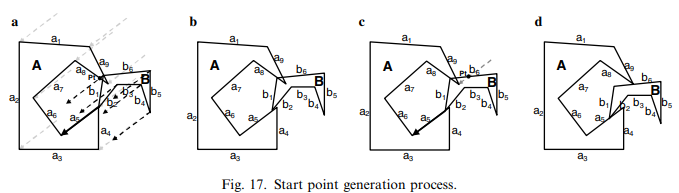

# 论文标题

不规则下料问题中的完全的鲁棒的临界多边形生成

Burke E K, Hellier R S R, Kendall G, et al. Complete and robust no-fit polygon generation for the irregular stock cutting problem[J]. European Journal of Operational Research, 2007, 179(1): 27-49.

# 摘要

临界多边形是一种可以在成对的形状之间使用的构造方式，用于快速有效地处理不规则二维下料问题中的几何形状。以前，临界多边形（No-Fit Polygon，NFP）未能得到广泛的应用的原因是缺乏通用的方案。因为通用方案可以处理所有问题，而不是只能针对某个具体的需求。本文介绍了一种鲁棒的轨道方法用于创建临界多边形，而且不会受到文献中其他方法遇到的典型问题的影响。此外，这个算法只包含两个简单的几何过程，因此易于理解与实现。我们演示了该方法如何处理已知的退化情况，例如：孔洞、互锁凹面、拼图类型的块，并且在文献中给出了32个不规则排样基准问题的生成时间，包括了真实世界的数据集，以便与现有的和未来的方法进一步比较。

## 关键词

切割，排样，临界多边形，轨道方法

# Ch01 介绍

切割与排样问题的二维不规则变体影响了许多重要的制造业，如：纺织、塑料、金属切割等等。这些问题通常面对的是如何将许多不规则的零件以最有效的布局放置在一张或者多张材料上，保证所有的零件都已经被排样，并且不会重叠。此外，由于问题的物理性质，例如：材质上的纹理、纺织品上的图案和所采用的切割技术，通常会对工件增加旋转约束。有些时候这类约束可以被用在非物理原因中，例如：将零件限制在有限的旋转集合中，从而简化布局的构建过程，并且允许获得更快的解决方案。二维下料问题已经被证明是NP难问题，因此本质上是很难解决的（Garey and Johnson, 1979）。有这么多不同的策略来解决不规则的块切割问题。这些方法包括线性规划方法、启发式布局方法、元启发式引导搜索技术和其他新颖的方法。例如：零件迭代挤压（Dowsland et al., 1998）。综述论文可见（Dowsland and Dowsland, 1992; Sweeney and Paternoster, 1992; Dyckhoff, 1990）。然而，连接所有方法的特征是它们都需要处理问题的几何形状。当使用高度不规则的形状（可能包括孔洞或者凹面）时，这可能特别复杂。鲁棒的并且有效的几何方法的实现可能是费力的，并且可能需要花费的时间比排样策略还多。具体来说，几何图形必须处理形状之间的所有交互，例如：检测两个形状是否重叠，并且计算沿给定方向所需要的移动距离，用于解决重叠问题。正如我们在下一节中所展示的，虽然这些检测可以使用三角函数来实现，但是临界多边形展现了一个更有效的解决方案。

在学术上，虽然临界多边形的生成具有挑战性，但它只是一个“工具”而不是“解决方案”，这可能是文献中这么多出版物在声明中使用临界多边形，但是在实现上只提供了很少的细节。在本文中，我们特别关注在临界多边形，并且提供了对历史技术的概述，以便用于形状的创建。此外，我们描述并且提供了实现一种新的鲁棒的轨道方法的全部细节，这种方法可以解决其他方法无法处理的传统问题。希望这将帮助进一步传播使用临界多边形的优势（相比于传统的三角函数方法）。

# Ch02 临界多边形——概述

在本节中，我们描述了临界多边形的功能，并且将其与传统的基于三角函数的重叠和相交测试进行了比较。我们还简要概述了以前的文献中用于生成临界多边形的许多技术。

## 2.1 临界多边形

在切割和排样领域领域，Art(1996)首次提出了临界多边形技术，尽管使用的术语是“形状包络”。十年后，Adamowicz 和 Albano 提出了术语“临界多边形”，并且基于临界多边形将形状使用最小封闭矩形打包在一起来解决不规则的原料分割问题。术语“构型空间障碍”通常在工程或者机器人运动规划领域用于表示NFP，但是这个术语也被用于切割和排样（Cuninghame-Green, 1989）。“速度图”经常在数学界用于描述临界多边形（Stoyan 和 Ponomaarenko, 1977; Scheithauer 和 Terno, 1993; Bennell 等, 2001）。临界多边形的主要功能是描述两个多边形的相交区域。下面的示例概述了NFP的构造。

给定两个多边形：$A$和$B$，一个形状可以通过环绕另一个形状的边界来寻找临界多边形。其中一个多边形的位置保持固定，另一个多边形沿着固定多边形的边缘遍历，同时确保两个多边形始终接触但是从不相交。在本文中，我们采用了第一个多边形是固定的，第二个多边形是移动或者环绕多边形。因此，当多边形$B$沿着固定多边形$A$勾勒轮廓时，输出的临界多边形记为$NFP_{AB}$。为了创建$NFP_{AB}$对象，我们必须从$B$中选择一个参考点，当$B$环绕$A$时参考点将被跟踪。在实现中，我们使用形状的顶点列表中的第一个顶点作为参考点（见图1）。参考点可以是任何点，只要它能够跟随环绕多边形支行。保持参考点相对于多边形$B$的相对位置也很重要，因为NFP测试重叠时需要使用。


图1：两个形状$A$和$B$的临界多边形

为了测试多边形$B$是否与多边形$A$重叠，我们使用了$NFP_{AB}$和$B$的参考点。如果多边形$B$的位置使其参考点位于多边形$NFP_{AB}$的内部，则其与多边形$A$重叠。如果多边形$B$的参考点在$NFP_{AB}$的边界上，则其与多边形$A$接触。如果多边形$B$的参考点在$NFP_{AB}$的外部，则其与多边形$A$没有重叠与接触（见图2）。文献中以下论文（Grinde 和 Cavalier, 1995; Ramkumar, 1996; Cheng 和 Rao, 1997; Dowsland 等, 1998, 2002; Milenkovic, 1999; Gomes 和 Oliveira, 2002）使用了临界多边形。


图2：在多边形$A$和$B$之间使用临界多边形检测相交性

## 2.2 临界多边形与标准三角几何在重叠检测上的对比

尽管临界多边形是成对多边形之间进行相交检测的优秀工具，但是在文献与现实世界的制造产业中，它还没有被广泛应用到二维排料问题中。毫无疑问，这是因为临界多边形的实现困难与缺乏可用的鲁棒的算法。相反，许多相交的实现使用标准的三角几何方法，特别是，这种方法出现实际应用的排料软件中，在这种情况下，分布式软件能够完全正确地处理所有可能的多边形就显得极为重要。然而，这两种方法虽然它们的总体效果相同，但是使用临界多边形的程序会比效率最高的三角几何的程序还要快好几倍。例如：我们希望尝试同一布局问题的多次迭代，预生成的临界多边形可以显著减少总计算时间。在多次迭代中，在重复的方向和位置上，三角几何方法可能会重复检测和解析相同的重叠形状。当一个排料的重叠解析方法需要计算两个相交形状的所有相交点时，临界多边形方法的优势将进一步增强，因为当使用三角几何方法时，为了满足检测冲突的需要，将会执行大量的相关计算。因此，通过使用临界多边形，我们可以将重叠检测问题（这是排料过程中影响计算的主要因素）的计算成本减少不对劲多边形检测中成本明显较低的点上（Dowsland 等, 2002）。除此之外，当 Burke 等人使用重叠分辨技术时（待出版），通过重复分辨y轴方向上的相交边来分辨相交形状，通过使用临界多边形的分辨技术将更加有效，在一次完整的移动中就可以解析y轴上的重叠。此外，临界多边形还允许在任意方向上通过从相关的参考点投射出一条射线，并且找到与临界多边形边界最近的交点来解决重叠问题。在下一节中，我们比较了用于检测和解决两个多边形之间重叠问题的几何过程，首先，使用标准三角几何，其次，使用临界多边形（NFP）。给定一个排料方法，假设多边形$A$有$7$条边，多边形$B$有$6$条边，我们希望检测两个多边形$A$和$B$的所有交点（见图3），因此每条边都会与其他的边进行检测，共进行42次检测用于确定相交的状态。此外，如果我们没有找到相交点，为了消除两个多边形穿过顶点相交的可能性，我们必须对两个形状上的所有点执行点内检测，这一共需要13次检测，因此在最坏的情况下总共需要55次检测。


图3：使用临界多边形实现的相交性检测

对于通过三角几何方法检测布局中任意两个多边形之间的交集，以上这些检测可以被视为一个很大但是不可避免的开销，而且开销会随着多边形数量的增加而变大。虽然可以尝试许多搜索方法，还可以开发快速的相交检测库，但是交集检测仍然占生成排料解时计算开销的相当大的一部分。此外，当我们希望使用搜索方法来开发大量的解决方案时，这些经常重复性的计算将对整体的计算时间产生相当大的影响。

现在回到图3，两个多边形的临界多边形$NFP_{AB}$也显示在问题空间的某个任意位置。在这种情况下，使用提出的“边滑动”技术生成的$NFP_{AB}$，方法是多边形$B$遍历多边形$A$上的边，并且通过跟踪遍历多边形的参考点$REF_B$来形成$NFP$。在创建$NFP$的笛卡尔空间中的坐标不会影响基于$NFP$来使用相交检测，因为我们可以基于参考点通过简单的计算，就能简单地根据$NFP$的位置生成正确的检测点（test point, tp）：$tp=REF_{NFP_{AB}}+REF_B-REF_A- Offset$，其中$Offset$是从多边形$A$（固定多边形）的参考点到临界多边形（$REF_{NFP_{AB}}-REF_{A}$）的参考点的向量。关于$NFP_{AB}$检测点（tp）的状态可以使用 O'Rourke(1998) 中描述的射线交叉算法计算。如果检测点（tp）在$NFP_{AB}$内，则多边形$A$和$B$相互发生碰撞。碰撞意味着两个多边形相交或者一个多边形在另一个内部。如果检测点（tp）在$NFP_{AB}$上，则两个多边形接触。如果检测点（tp）在$NFP_{AB}$外，则两个多边形既没有接触也没有碰撞。当执行多重迭代排样时，通过计算所有的成对多边形的全部临界多边形，我们可以显著地节省计算时间。

## 2.3. 构造临界多边形的方法

这里，我们通过文献回顾了以往用于构建临界多边形的主要技术。对于每种方法，我们都做了简要的概述，并且讨论了使用这个方法的可能出现的任何优点和缺点。

### 2.3.1. 凸多边形

两个多边形都是凸多边形是临界多边形生成的基本形式。给定两个凸多边形$A$和$B$，通过以下步骤创建临界多边形：❶逆时针确定形状$A$的方向，顺时针确定形状$B$的方向（见图4a）；❷将$A$和$B$的所有边移动到一个点（见图4b）；❸沿逆时针顺序连接这些边产生临界多边形（见图4c）。


图4：对于凸形状生成临界多边形

Cuninghame-Green使用这种方法在凸多边形对之间产生“构型空间障碍”，然后形状排列中将之用于相交检测（Cuninghame-Green, 1989）。对于包括非凸多边形的实例，Cuninghame-Green首先计算每个非凸形状的凸包（包含凸多边形的最小值），然后使用各自的凸包计算临界多边形。

凸的临界多边形生成算法是基于标准排序算法与通过平移实现的边再排序相结合，其优点是简单，速度快。明显的缺点是对于非凸的形状无法生成对应的临界多边形，并且凸包的简化导致凸的部分在排料中是无效的，在机器人运动规划中是不可穿越的。因为这会对解决方案的质量产生不利的影响，所以需要其他方法。

### 2.3.2. 非凸多边形

存在许多不同的方法从非凸形状中生成临界多边形。这些设计方法可以分为三大类：分解、“Minkowski和”与轨道方法。

#### 2.3.2.1 分解

第一种方法是将任何非凸形状分解成更容易“管理”的子块。然而，分解通常会出现多个子块，因此必须创建多个临界多边形。为了进行相交检测，临界多边形可以保持分解的状态，或者通过并集操作组合在一起。在可能的情况下，单个临界多边形提供了最快的相交计算时间，但是还需要额外的计算来重组组成的成分。如果存在几个子部分，那么这个计算任务就会变得昂贵且困难。如果还有孔洞，那么任务可能会更加复杂。例如：Agarwal等人(2002)对不同的涉及构造非凸多边形的“Minkowski和”的分解和组合任务进行了广泛的研究。他们得出的结论是使用最优分解将会适得其反，因为计算他们消耗的计算时间超过了重组过程中获得的好处。作者报告说，重组操作是最昂贵的，并且给出了例子的执行时间，对于包含少量凹陷的形状执行时间为几秒，对于高度不规则的形状执行时间为20分钟。Avnaim和Boissonnat(1988)讨论了一种基于线性分段的分解重组方法。这些被用来产生平行四边形，这些平行四边形被重新组合以产生NFP。作者提供了一个数学证明，表明该方法可以处理一般情况，并且进一步扩展到允许旋转。该算法的时间复杂度为$O(m^3n^3\log mn)$。

*2.3.2.1.1 凸块*

我们已经讨论过，当涉及到凸形状时，临界多边形的生成是件小事。如果是具有凹面的形状可以被分割为凸块，然后快速凸临界多边形生成技术仍然可以使用。通过将非凸形状分解成凸块从而对几何相交进行简化的工作，在（Avnaim和Boissonnat, 1987; Cuninghame-Green, 1992）中被提出和讨论。这种方法的主要困难是分解和重组算法。许多著名的方法，包括分解成三角块或凸块的方法，都可以应用其中。（Seidal, 1991）提出了一种快速的多边形三角剖分算法，其复杂度为$O(n\log n)$。三角剖分的进一步实现参考（Amenta, 1997）。然而，就目的而言，三角剖分方法产生的子块的数量相比必需的数量超出太多，并且最终会影响生成过程中的计算时间。三角剖分可以被看作凸分解的特殊情况，与其不同的是广义的凸分解算法的目标用少量的凸块来表示多边形。两个关键的方法是：拥有$O(n)$复杂度的次优分解（Hertel 和 Mehlhorm, 1983），和拥有$O(n^3)$复杂度的最优分解（Chazelle 和 Dobkin, 1985）。（Agarwal 等，2002）提出受创建最优分解时固有的计算开销影响，使用次优分解通常更加有效，但是他们也建议寻找一种可能更有效的方法来执行凸覆盖用于替代。一旦任何不规则的多边形被分解成凸块，就可以通过将形状$B$的每个凸块环绕形状$A$的每个凸块来生成临界多边形。这种方法的缺点是凸块的临界多边形可能交叉，在重组它们以构建临界多边形时必须小心。如果原始形状包含孔洞，则会出现特定的困难，因为相交的临界多边形的子块是否定义了可以忽略的孔洞或区域是不明确的。

*2.3.2.1.2. 星形多边形*

Li 和 Milenkovic 将形状分解成凸形和星形多边形。星形多边形具有的属性是：至少存在一个内部点或者“核心点”，通过“核心点”可以“看到”多边形的整个边界。通过扩展凹面边缘和消除不可见区域可以发现星形多边形拥有一个区域$R_{kernel}$，这个区域可以被定义为在区域内放置一个核心点就可以看到整个多边形边界。而非星形多边形则正好相反，因为没有定义可以放置核心点的区域。因此，就一般性而言，星形多边形介于凸与非凸形状之间。Li 和 Milenkovic 指出星形多边形在“Minkowski和”的运算下是“闭合”的，并且证明了两个星形多边形在“Minkowski和”方法下也会产生星形多边形（Li 和 Milenkovic，1995）。作者没有说明的是他们是否将多个临界多边形区域组合成一个临界多边形实体，或者他们是否在布局生成阶段执行多个临界多边形的相交检测。

*2.3.2.1.3. $\phi$函数*

Stoyan等提出了一种可替代的、有前途的基于“$\phi$-函数"使用的方法。$\phi$-函数定义了成对的标准对象或者“主要”对象（如：矩形、圆形和凸多边形）之间的数学相交关系。尽管严格来说，$\phi$-函数不是一个基于临界多边形的方法，但是它也被包括在内是因为它已经有了非常有前途的结果。作者进一步发展了他们的工作，通过主要对象的并、交、补来定义非凸多边形的数学相交关系（Stoyan等，2002）。在布局生成过程中，两个形状的合成相交检测是通过比较所有成对的主要对象的$\phi$-函数来执行的，这些成对的主要对象用于定义形状$A$和形状$B$。$\phi$-函数的第二个好处是，它们是基于主要对象之间的距离函数，因此可以很容易地用来寻找两个复杂对象之间的距离。

#### 2.3.2.2. Minkowski 和

临界多边形的构造可以通过使用“Minkowski 和”（向量加法的一种形式）进行统一，并且由（Stoyan 和 Ponomarenko，1997）首先提出。概念如下：给定两个任意点集$A$和$B$，这两个集合的“Minkowski 和”的定义如下：
$$
A\oplus B=\{a+b:a\in A,b\in B\}
$$
为了生成临界多边形，我们必须使用“Minkowski 差”$A\oplus-B$。这个公式对应输入的两个相反方向的多边形，并且很容易通过简单的向量代数进行展示（Bennel 等，2001）。我们将形状$A$置于逆时针方向，将形状$B$置于顺时针方向，这种在（2.3.1 节）中的简单的仅凸的例子就可以用于验证。我们可以指出，在包含仅凸的形状下，Cuninghame-Green的方法在其最基本的形式中也使用了“Minkowski 差”。

虽然这类方法的非数学的实现细节很少，但是Ghosh和后续的Bennell为临界多边形的区域计算提供了出色的解释和实现的细节。因此，我们请读者参考他们的贡献（Ghosh，1991，1993；Bennell 等，2001）。这种方法的主要缺点是其只能工作在两个形状的凹面之间互不干涉或者不互锁（Ghosh，1991，1993）。（Bennell 等，2001）指出Ghosh的方法将导致“相交边缘的难以处理的缠绕“，这将很难重新组合以形成临界多边形。他们引入了一种方法，用于减少”缠绕边缘“出现的数量，并且给出的实现的细节。他们还报告了文献中五个独立的数据集快速生成时间，每个约为0.3秒。然而，他们也表示这些方法不能处理内部的孔洞，因为很难检测哪些内部的临界多边形的边缘可以被丢弃，哪些形成了内部临界区域。

#### 2.3.2.3. 轨道滑动方法

轨道滑动方法是本文的主要焦点，它涉及使用标准的三角几何来物理滑动一个多边形环绕另一个多边形。临界多边形是通过跟踪环绕时滑动多边形的轨迹点的运动来定义的。（Mahadevan，1984）在其博士论文中第一次详细讨论和实现了轨道方法来产生”包络”。Mahadevan的方法的关键要素是：如何计算接触顶点和接触边、如何确定平移向量、如何计算平移长度。“D函数”的概念是用来计算相交边的（Konopasek，1981）。Mahadevan将“D函数”检测修改用于计算接触点，这个计算方法对于Mahadevan的算法和我们的新方法都是必需的。然后，利用这个信息基于接触边选择平移向量。然后，通过轨道形状的每个顶点对平移向量进行投影。然后，使用相交边检测计算平移距离。将平移向量投影到固定多边形的反方向也很重要。然后，轨道形状沿着平移向量平移最小的距离（从投影和相交检测）。这样确保了两个多边形从不相交，但是总保持接触。该过程持续进行，直到轨道多边形返回到其原始的起始位置。这里，我们就不描述Mahadevan方法的更多细节，因为它的许多特征也在我们的新轨道方法中使用（第3节），并且针对适用情况，我们的与Mahadevan的方法进行了比较，还指出了我们的新方法中的改进。Mahadevan方法的主要缺点是，它不能为包含了孔洞或者一些凹面的形状生成完整的临界多边形。当轨道多边形可以被放置在固定多边形的凹面内，但是凹面具有狭窄的入口时，问题就会出现。在这种情况下，轨道多边形太宽了，将会滑过凹面。在第4节中，我们展示了新的轨道方法如何为所有已知的退化情况生成临界多边形。

# Ch03 一种新的临界多边形构造算法

现在，我们描述新的方法，利用标准的三角几何技术，通过使用轨道方法，鲁棒地生成临界多边形。在我们提出的实现中，对于相交计算，使用鲁棒的几何库是很重要的。实现尽可能快速的和尽可能接近最优的程序也是有益的，以便提升临界多边形的生成和排样算法的速度。我们已经实现了这样一个库。虽然这可能是一个非常耗时，也非常困难的任务，但是在大多数标准几何计算机图形文本（O'Rourke，1998）和互联网上的几个计算几何论坛上都中可以找到对所需算法讨论。对于不希望自己开发这种库的从业者来说，LEDA和CGAL库中的几何模块可能是更好的选择。讨论实现过程中每个几何案例的使用超出了本文的范围。

## 3.1. 概述

我们的方法可以分为两个逻辑阶段。第3.2节描述了第一个过程，具体为一个多边形环绕另一个多边形滑动，以创建两个形状的临界多边形的外部路径。这一部分遵循的方法在逻辑上类似于Mahadevan的算法，虽然提出了一个修改的实现。第3.3节描述了第二个过程，介绍了起始位置的概念和标识，允许算法找到临界多边形的剩余路径。这些路径将会是临界多边形的内部孔洞（即，包含在外部路径中），并且没有出现在Mahadevan的算法中。在本节中，我们将假设两个逆时针方向的多边形$A$和$B$，它们存在于二维空间的某个地方，我们需要产生临界多边形$NFP_{AB}$（围绕多边形$A$轨道化的多边形$B$）。必须执行的第一个操作是平移多边形$B$，使其与多边形$A$接触但是不相交。我们保持了与Mahadevan相同的方法，即平移多边形$B$，使其最大y-坐标位于多边形$A$的最低y-坐标（见图5）。


图5：轨道多边形的初始化平移接触固定多边形

使用这两个顶点进行对齐可以保证$A$和$B$只会接触不会相交。这种平移导致多边形$B$接触多边形$A$的公式如下：$\text{Trans}_{B\rightarrow A}=\text{Pt}_{A(y_{\min})}-\text{Pt}_{B(y_{\max})}$。

现实中，只要多边形$A$和$B$只接触不相交，任何起始位置都可以被使用。现在，轨道方法可以开始沿着逆时针方向生成临界多边形的外部路径。

## 3.2. 轨道与滑动

算法的轨道运动（或者滑动）部分的主要目的是检测正确的运动，即$B$必须环绕$A$遍历，以便返回其原始的位置。这是一个迭代过程，每个平移步骤都会创建一个临界多边形的边。这可以进一步细分为下面的子部分，这些子部分将依次讨论：检测接触边、创建潜在的平移向量、寻找可行的平移、修剪可行的平移，以及最终应用可行的平移。

### 3.2.1. 检测接触边

正确地检测接触边和相交边的能力对于我们方法的成功至关重要。这个能力是通过检测多边形$A$的每条边对应多边形$B$的每条边来实现的。每一对接触边（一条边来自于多边形$A$，一条边来自于多边形$B$）与接触顶点的位置存储在一起。图6展示了每对接触边的结果集。对比Mahadevan的方法，他使用的是一个接触顶点的所有边来执行计算。例如：在图6中，Mahadevan将会在同一个图上表示边$a2, a3, b1, b4$，根据我们的经验，这样使得所需的计算冗长且难以解释。


图6：每对接触边的辨识

### 3.2.2. 创建潜在的平移向量

将多边形$B$平移去轨道化多边形$A$所使用的向量必须根据具体情况从多边形$A$的或者多边形$B$的边中推导出来。图7展示了每种情况的例子。


图7：平移向量：(a)从边 $a_3$中推导得来；(b)从边$b_1$中推导得来

注意，在图7的第二个例子中，因为多边形$B$沿着它自己的一条边滑动，所以平移向量通过反转这条边来找。通过多边形$A$关于多边形$B$的相对运动进一步验证了这一点。多边形$A$沿着边$b_1$完成了相对移动。实际上，多边形$A$必须保持固定，而多边形$B$必须平移，因此平移向量在这种情况下是反向的。通过使用成对的接触边我们可以得到潜在的平移向量的集合。成对的接触边的类型存在三种可能性：(i)两条边在一个顶点接触；(ii)轨道边的一个顶点接触固定边的中间；(iii)固定边的一个顶点接触轨道边的中间。这些例子如图8所示。


图8：成对接触边的类型

每一对接触边产生一个潜在的平移向量。在类型(ii)中，平移向量被简单地定义为使用两条边的接触点和固定边的终止顶点。在类型(iii)中，我们使用类似的过程，例外是我们使用轨道边的终止顶点，并且还反转了向量的方向。在类型(i)中，要求正确地识别潜在的平移向量是从固定多边形的还是从轨道多边形的边导出。基于接触顶点和一种检测，即检测轨道边$b$在固定边$a$的左侧还是右侧，然后通过下面的规则集就可以正确识别平移向量。表1中展示了不同的可能性，以及在每种情况下导出潜在的平移向量的边。

我们现在将阐明为什么表1中在某些情况下可以消除一些潜在的平移（表中用“-”描述的条目表示没有平移被导出）。回想一下，当从一条边中导出一个平移时，结果向量是由“接触点→终止顶点”定义的，并且这个向量是反向的轨道边。因为固定多边形的和轨道多边形的边都接触到了终止顶点，于是将导出一个空的平移向量，因此这允许我们消除表中的案例7。在案例3与4中，轨道多边形的边在它的终止顶点接触，因此不能从轨道多边形的边中导出平移。在案例5与6中，固定多边形的边不能被使用，因此它们将会输出空向量。我们在图9中通过两个多边形在两个不同的位置接触展示了表1中的每个案例。

表1：当两条边在顶点接触时，推导出潜在的平移向量

| 案例 | 固定多边形接触边的顶点 | 轨道多边形接触边的顶点 | 轨道边相对于固定边的相对位置 | 平移向量的导出来源 |
| ---- | ---------------------- | ---------------------- | ---------------------------- | ------------------ |
| 1    | 起始顶点               | 起始顶点               | 左侧                         | 轨道边             |
| 2    | 起始顶点               | 起始顶点               | 右侧                         | 固定边             |
| 3    | 起始顶点               | 终止顶点               | 左侧                         | -                  |
| 4    | 起始顶点               | 终止顶点               | 右侧                         | 固定边             |
| 5    | 终止顶点               | 起始顶点               | 左侧                         | -                  |
| 6    | 终止顶点               | 起始顶点               | 右侧                         | 轨道边             |
| 7    | 终止顶点               | 终止顶点               |                              | -                  |
| 8    |                        |                        | 平行                         | 固定边+轨道边      |

在案例3与5中，因为轨道多边形的边在固定多边形的边的左侧，因此无法导出平移。例如：边$a_3$在边$b_2$分别在它们的起始顶点和终止顶点处接触。当我们使用边$b_2$产生空平移时（因为与终止顶点接触），唯一的可能性是从固定边$a_3$中导出平移向量。然而，边$b_2$在边$a_3$的左边，如果使用这个平移向量，边$b_2$将会沿着边$a_3$的内部执行滑动。因此，位置的“左检测”消除了多边形沿着边的内部而不是外部执行平移滑动。当两条边平行时，无论是固定边还是轨道边都可以被使用。


图9：两个多边形在不同位置的接触和顶点到顶点的接触案例

### 3.2.3. 寻找可行的平移向量

一旦产生了潜在的平移向量，我们接下来会选择一个不会导致直接相交的平移向量。例如：在图9中我们生成了两个潜在的平移向量$a_1$和$b_3$。可以看出，为了逆时针环绕多边形$A$移动，轨道多边形$B$必须使用向量$b_3$完成平移。如果我们沿着向量$a_1$平移多边形$B$，将导致边$a_2$和$b_3$（以及$a_3$和$b_3$）之间的直接相交。从第3.2.1.节中生成的成对的接触边的集合再次包含了所需的所有信息，这些信息用于确定一个可行的平移向量。由于我们提出了接触边的表示法，因此在这里确定过程是简化了的。这个过程包括了依次取出在第3.2.2.节中确定的每个潜在平移向量，并将它们放置在每对接触边的接触位置上。基于左/右区域的并集，我们可以定义位置关系，这是个用于描述固定多边形的和轨道多边形的接触边之间的位置关系，这种关系指出了特定的潜在平移是否适合这些边。为了确定潜在的平移向量是否可行的，算法必须适用于每一对接触边。图10展示了一些例子，例子中有成对的接触边和接触点的角度方向（由圆弧同），因为这些点使得边$b$可以在不与边$a$相交的情况下移动。


图10：确定平移的可行的角度范围（由弧确定）

为了简洁起见，我们没有列出可能发生的所有情况（图10中的例子为导出省略关系提供了足够的信息）。在图9中，我们为两个接触的多边形计算了两个潜在的平移向量$-b_3$和$a_1$。图11描述了消除平移向量$a_1$的方法（为了简化，我们已经省略了包括边$a_1$的成对边，但是这些省略的边也可能会成为可行的平移，因为平移向量也是$a_1$）。一旦在这样的一次检测中潜在的平移失败，则平移是不可行的，并且会被消除。


图11：消除潜在的平移向量$a_1$

在这个阶段，我们能够找到了一个（或者多个）可行的平移向量。通常只存在一个平移向量，但是在如图12（我们实现中的实际截图）描绘的特殊情况下，可能会存在几个平移向量。为了清晰起见，轨道正方形的中心点被设定为参考点。


图12：包含精确匹配“通道”的两个多边形

这引入了我们算法的另一个重要方面：我们必须保持用于生成先前平移向量的边。当存在几个可行的平移向量时，我们选择距离前一个移动最近的边（按边的顺序）。因此，回到图12可知正方形使用边$a_3$进入通道，而不是使用边$a_{14}$在开口上直线滑动。然后，沿着固定多边形的中心滑入以后，正方形具有从边$a_4$、$a_7$、$a_{10}$和$a_{13}$导出的四个可行的平移向量。然而，选择从边$a_4$导出的平移向量，是因为先前使用的是从边$a_3$中导出的平移向量。这是我们对Mahadevan方法的另一个改进，并且显著地改善了方法的通用性。

### 3.2.4. 修剪可行的平移向量

在平移多边形$B$之前，修剪平移向量是最后一步。这点很重要，是因为可能有其他边会干扰轨道多边形的平移。图13a 提供了应用整个平移向量导致两个形状相交的例子。为了防止轨道多边形进入到固定多边形的体内，可靠的平移$a_7$必须被修剪到边$a_1$（见图13b）。


图13：平移向量需要“修剪”防止相交

为了找到正确的非相交平移，我们在多边形$B$的每个顶点投影到平移向量，并且检测它与多边形$A$的所有边的相交性。这能确保我们正确地识别了将会与多边形$A$相交的多边形$B$的所有顶点，并且使用公式2来减少平移距离。
$$
\text{新的平移}=\text{相交点}-\text{平移}_{起始点}
$$
我们还必须将平移向量从多边形$A$的所有顶点投影回来（通过将平移向量的终止顶点平移到每个顶点上），并且与多边形$B$的所有边执行相交检测，以测试是否有边与多边形$B$相交。在图14中使用相同的例子，但是不同的轨道多边形进行了描述。


图14：从多边形$A$中基于投影执行修剪

再一次，如果存在相交，我们可以和公式3来减少平移距离：
$$
\text{新的平移}=\text{平移}_{终止点}-\text{相交点}
$$
我们的方法与Mahadevan的方法基本相同，区别在于我们在相交时修剪平移向量，而Mahadevan则保持平移向量不变，但是存储最小相交距离，再在所有投影完成后修剪一次。由于我们的算法在每次相交时都执行修剪，经过检测过程后，平移向量变得更短。这个检测过程可以减少相交的数量，而相交的发生是因为使用包围盒执行的快速消除检测，这种使用包围盒检测相交的速度比标准的线相交要快得多。Mahadevan的方法可能需要计算几个更完整的相交检测，因为在每个投影中都使用了全部平移向量，并且可能有更多的计算需要。

### 3.2.5. 应用可行的平移向量

最后一步是将修剪后的平移向量附加到目前为止创建的部分临界多边形的终点，基于修剪后的平移向量来平移多边形$B$。这将移动多边形到下一个“决策”点，并且这个过程可以从接触边检测过程（第3.2.1.节）中重新开始。这个过程的唯一附加检测就是我们必须执行一个检测来发现多边形$B$的参考点是否已经返回到其初始的起始位置。

## 3.3. 起始点

在第3.2.节中，我们使用边比较和边滑动确定了一个多边形环绕另一个多边形进行轨道化的方法。这个方法的总体效果类似于Mahadevan提出的算法。然而，已经提出的一些改进使得这个算法需要的计算量更小，并且也更容易解释。因此，我们的方法与到目前为止提出的一些轨道方法具有相同的局限性，例如：无法为涉及互锁凹面、拼图块或者孔洞的形状生成完整的临界多边形（见第4.节）。图15a 展示了两个多边形仅使用滑动算法无法生成完整的临界多边形。两个多边形具有凹面部分，因此会导致互锁，由于固定多边形凹面部分的狭窄入口（见图15b），从而在进一步生成临界多边形区域时无法实现。


图15：互锁凹面(a)两个多边形，(b)仅使用滑动方法的临界多边形，(c)完整的临界多边形

在本节中，我们描述了一种基于可行地接触，但起始位置不相交的识别方法，利用这个方法可以使用前面描述的滑动技术来生成剩余的临界多边形构造的内部循环。例如：如果多边形$B$可以放置在图15c，则可以使用滑动算法来生成内部的临界多边形。通过对第3.2.节中描述方法的修改，找到可行的起始位置，这个过程再次包含了滑动。然而，我们对滑动追踪临界多边形不感兴趣，而是沿着特定的边向量执行平移时来解决边相交问题。为了解释这个过程，我们将检验一个例子，即沿着多边形$A$的边寻找起始位置。然后，这个过程可以很容易地为多边形$A$与多边形$B$的每条边重现，为创建所有可行的起始位置，从而允许多边形$B$对多边形$A$进行轨道环绕，最终创建完整的临界多边形。给定多边形$A$的一条边$e$，我们可以检测沿着边$e$轨道多边形$B$的潜在起始位置。这个过程可以包括平移多边形$B$，使$B$的每个顶点依次与$e$的起始顶点对齐。对于每个位置，我们都执行以下的步骤：如果多边形没有在位置上相交，则将这个位置记为两个多边形的可行的起始位置。如果多边形$B$与多边形$A$相交，则我们必须执行进一步的检测，并且最终使用边的滑动来沿边$e$执行遍历，直到找到一个不相交的位置或者到达边的末端。在这种情况下，第一个检测中包括了多边形$B$的两个连通边（在接触顶点处连接），这些边或者同时在边$e$的右边，或者与之平行。如果多边形$B$的任意一条连通边在边$e$的左侧，则它们将在多边形$A$的内部执行平移，并且可以被立即消除，因为当他们沿着向量$e$滑动时，将永远不会产生可靠的起始位置。

图16a展示了一个例子，描述的是成对的连通边$b_3$和$b_4$在沿着$a_5$滑动时被消除，因为$b_4$在$a_5$的左边（注意：当使用的是多边形$B$的边$b_4$和多边形$A$的连通边$a_4$和$a_5$时就不会发生消除）。图16b展示了一个例子，描述的是两个连通边$b_1$和$b_2$都在边$a_5$的右边。


图16：使用边$a_5$实现的多边形$B$到多边形$A$的顶点对齐：(a)无效对齐；(b)有效对齐

现在，假设两条连通边在边$e$的右边，并且多边形$A$和$B$相交，我们可以尝试沿着$e$定义的平移向量通过平移轨道多边形来解决覆盖问题。与前一节一样，我们现在可以对该向量进行修剪（过程相同）。导出的平移向量可以被应用到沿着边$e$滑动多边形$B$，然后执行另一个相交检测。如果两个多边形仍然相交 ，则使用平移向量重复这个过程，平移向量来自于边$e$从接触点到终止顶点的推导。如果相交被解决，则多边形$B$的参考点是一个潜在的起始位置。如果边$e$被完全遍历，但是仍然存在相交，则沿着边$e$和多边形$B$的对齐顶点或者连通边也无法找到可行的起始位置。然后，考虑多边形$B$的下一个顶点，依次类推直到检测完所有边顶点的可能性。注意：使用多边形$A$的顶点检测多边形$B$的边也很重要，但是由于这个过程与前面的相同所以不再讨论。图17展示了基于图17b的例子实现的这个过程。当使用$a_5$和连通边$b_1$与$b_2$的顶点对齐时，两个多边形的初始状态是相交的，因此我们需要沿着从边$a_5$中导出的向量来解决相交问题。



图17：起始点生成过程

图17a展示了修剪过程和最近相交点（$\text{Pt}$）的识别。将此平移应用到多边形$B$后，两个多边形不再相交，因此找到了一个可行的起点，还可以再次使用标准的轨道方法生成临界多边形的环。我们在实现中包含的一个过程是使用秕 3.2. 节中介绍的方法来计算外部的临界多边形的环，然后我们依次在多边形$A$到多边形$B$中未遍历或者未标记的边上应用起始位置过程。在这个过程中，一旦找到一个可靠的起始位置，我们就计算从中导出的临界多边形的内部循环（标记边，是它们已经像以前一样被遍历）。这能确保算法的速度，因为随着在新的临界多边形环的产生，更多的边将被标记，因此减少了生成新的可行的起始点需要的计算要求。重复这个过程，直到所有的边都已经被看见，或者所有的可靠的起始位置都已经有效，并且返回了完整的临界多边形。

## 3.4. 摘要

给定了前面几节的功能性描述，我们可以使用下面的伪代码描述临界多边形的生成过程：

```pseudocode
输入：Polygon A, Polygon B

Pt_A(y_min)=最小点 x 多边形A的值
Pt_B(y_max)=最大点 x 多边形B的值
IFP=初始的可行位置（initial feasible position）
bool bStartPointAvailable=true;
Point NFPLoopStartRefPoint;
Point PolygonB_RefPoint;
Array[Line[]] nfpEdges; // 使用 Line 型数组 存储 多边形边的数组
int loopCount = 0; // NFP 环的数目

Begin
	使用平移 Pt_A(y_min)-Pt_B(y_max) 在 IFP 中放置多边形
	NFPLoopStartRefPoint=Pt_B(y_max);
	PolybonB_RefPoint=Pt_B(y_max);
	while(bStartPointAvailable){
		bStartPointAvailable=false;
		// 找到接触点和分块接触所使用的这些点，用于生成接触结构
		Touchers[] toucherStructures=FindTouchers(A,B);
		
		// 消除不可行的会产生立即相交的接触
		Touchers[] feasibleTouchers=CanMove(A,B,toucherStructures);
		
		// 相对多边形 A 与 B，修剪平移
		Touchers[] trimmedTouchers=Trim(feasibleTouchers,A,B);
		
		// 通过长度对修剪后的平移排序
		Touchers[] lengthSortedTouchers=Sort(trimmedTouchers);
		
		// 沿着最长的可行平移向量平移多边形 B
		B.Translate(lengthSortedTouchers[0].Translation);
		
		// 增加平移到 nfpEdges；基于静态标记遍历边
		nfpEdges[loopCount].Add(lengthSortedTranslations[0].Translation);
		A.MarkEdge(lengthSortedTranslations[0].StticEdgeID);
		if(NFPLoopStartRefPoint==PolygonB_RefPoint) // 完备 NFP 环
		{
			Point nextStartPoint;
			// 找到下一个可行的起始点 - 重置 PolygonB_RefPoint 到相关点
			bStartPointAvailable=FindNextStartPoint(
				A,B,&nextStartPoint, &PolygonB_RefPoint);
            
            if(bStartPointAvailable){
            	// 平移多边形 B 到 nextStartPoint
            	B.Translate(PolygonB_RefPoint-nextStartPoint);
            	
            	NFPLoopStartRefPoint=nextStartPoint;
            	loopCount++;
            }
		}else{
			bStartPointAvailable=true; // 容许继续遍历边
		}
	}
	NFP_AB=Complete(nfpEdges);	//	从 nfpEdges 中复原 NFP
	End
```

函数`FindNextStartPoint`的伪代码：

```pseudocode
Input: PolygonA, PolygonB, Point &nextStartPoint, Point &PolygonB_RefPoint

Int A_EdgeCount=PolygonA.EdgeCount;
Int B_EdgeCount=PolygonB.EdgeCount;
Edge staticEdge;
Edge movingEdge;

Begin
    for(int i=0;i<A_EdgeCount;i++){
        if (PolygonA.IsEdgeMarked(i))
            coutinue;
        else
            StaticEdge=PolygonA.GetEdge(i);
        for(int j=0;j<B_EdgeCount;j++){
            movingEdge=PolygonB.GetEdge(j);

            // 移动 PolygonB 使得 movingEdge 在静态边的起始处开始
            PolygonB.Translate(movingEdge.Start-staticEdge.Start);
            Bool bFinishedEdge=false;
            Bool bIntersects=PolygonB.bIntersectsWith(PolygonA);
            while(bIntersects AND !bFinishedEdge){
                // 滑动边直到不再相交或者到达 staticEdge 的终点
                Toucher currentToucher=MakeToucher(staticEdge.Start);
                Toucher trimmedToucher=Trim(currentToucher, PolygonA,PolygonB);
                PolygonB.Translate(trimmedToucher.Translation);

                bIntersects=PolygonB.bIntersectsWith(PolygonA);
                bFinishedEdge=(bIntersects and (movingEdge.Start==staticEdge.End))
            }
            // 标记遍历边为看过（表示边的起始点是否被找到）
            staticEdge.Mark(true);

            if(!bIntersects){
                //设置点的参考位置，并且传给 nextStartPoint
                nextStartPoint=movingEdge.Start;
                PolygonB_RefPoint=movingEdge.Start;
                return true;
            }
        }
    }
    return false;
    End
```

# Ch04 问题案例

在本节中，我们讨论了导致其它方法面临困难的每一个问题案例，并且展示了我们的方法为什么能够在没有特定的案例对案例的情况下处理它们。在本节的每个图中，我们分别用深灰色和浅灰色来标注固定多边形和轨道多边形，使用黑点来显示轨道多边形的参考点。这个方法用于跟踪临界多边形的循环过程（过程已经编号）。我们在联机手册中为本文提供了这些问题案例的数据。

## 4.1. 互锁的凹面


凹面的互锁是以前的文献中给出的轨道滑动方法（Mahadevan，1984）的典型问题。图18展示了我们实现的截图，通过将其中一个多边形旋转180度生成相同形状的临界多边形。这些方向上的形状涉及了这两个凹面的许多不同的相互作用，因此涉及多个可行的起始点。这两种形状的临界多边形会在临界多边形中产生6个环形（一个是外环1，和5个内环2~6）。


图18：多个互锁的位置

## 4.2. 精确匹配：滑动

下个例子描述的是通过精确匹配“通道”的滑动问题，这个问题无论是“Minkowski和”方法（Bennell等，2001），还是轨道方法（Mahadevan，1984）都无法处理。我们提出了对Mahadevan算法的扩展，它可以通过保持先前遍历的边来处理这个问题，因此能够在下一次平移迭代中使用固定多边形的连续边（见图19）。我们之前在图12中讨论了这个情况的另一个例子。


图19：通过“通道”滑动实现精确匹配

## 4.3. 精确匹配：拼图块

包含完全连接在一起的拼图块（也称为“钥匙和锁”）的问题案例是第4.1.节中概述的互锁凹面案例的另一种形式。然而，拼图块的显著特征是它们在没有运动的情况下组合在一起，因此在临界多边形内部创建了一个单一的可行点（而不是互锁凹面案例的内部环）。在我们的方法中，通过生成可行的起始位置来找到这个可行点的位置。当然，算法仍然还会尝试沿着边滑动轨道多边形，但是在这样的情况下，没有可行的平移向量，也就无法区分这个位置仅是一个异常的可行点的位置（见图20）。以前的大多数方法都受到这样的退化情况影响，包括：“Minkowski和”方法，无法在没有边界存在的条件下，在临界多边形内部识别钥匙和锁的位置；凸分解方法，无法仅仅通过重组来找到这个位置；Mahadevan滑动算法，遇到的与互锁凹面中相同的困难（参见第4.1节）。


图20：拼图块：(a)临界多边形的外环；(b)异常的可行的内部位置

## 4.4. 孔洞

文献中少有方法能够有效地处理含有孔洞的形状。这可能是因为包含孔洞的临界多边形的生成过程存在困难。然而，通过检测可行的起始位置，可以容易地、更大量地、全面地生成临界多边形。

图21展示了具有两个孔洞的形状，和在内部多个不同位置包含孔洞的区域中放置形状的例子。该图展示了一个混合的案例，包含了孔洞和互锁凹面：环1是临界多边形的外环，环2、3、5、6、7是所有的洞的例子，环4和8是较小的轨道形状的凹面与固定形状的较大的孔洞内的狭窄间隙相互作用的案例。此外，凸分解会导致大量的小块碎片，并且随着孔洞的引入而变得更加困难。因此合并与重组也受到解开大量的相交的子临界多边形元素的影响。Stoyan的“$\phi$函数“通过分解主对象来处理许多退化问题。然而，这个方法最终会影响相交检测的效率，因为许多分离的检测需要被执行（特别是非常复杂的形状）。先前的轨道方法也仅能生成临界多边形的外环，”Minkowski和“方法也因为边的解混而变得困难。作者未曾发现任何先前的临界多边形方法能够专门针对这种退化的形状给出特定的临界多边形构造方法。


图21：两个多边形的临界多边形：其中一个包括多个孔洞

# Ch05 基准问题的生成时间

<!--ToDo：因为与算法关系不大，仅供实践时参考，因此待需要再翻译-->

# Ch06 摘要

在本文中，我们回顾了文献中用于生成临界多边形的主要技术，并且表明，相对于传统的基于三角几何的方法，对于开发更快的自动排料算法，它是重要的构造基础。提出了临界多边形的轨道方法的一个完整的鲁棒的实现。这种方法可以处理以前的方法不能轻易解决的退化问题。此外，基于文献中的有效的基准问题，我们展示了算法生成临界多边形所需要的时间是合理的，并且生成的结果与（Bennell等，2001）的方法是一致的。就作者发现，在文献中一个轨道临界多边形生成过程的完整实现是第一次提出，而且还是第一次对这样的方法进行了严格的研究，以了解已知的退化情况的鲁棒性，并且对现在的基准数据提供了如此广泛的计算结果。

