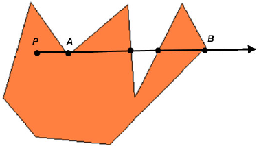
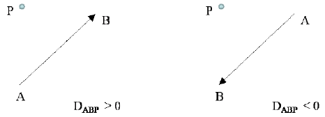
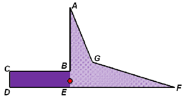
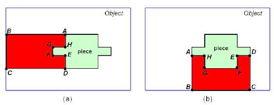

# 的最论文标题

二维不规则装箱问题的一种有效启发式算法

López-Camacho E, Ochoa G, Terashima-Marín H, et al. An effective heuristic for the two-dimensional irregular bin packing problem[J]. Annals of Operations Research, 2013, 206(1): 241-264.

# 摘要

本文提出了一种适应于二维不规则装箱问题的Djang和Finch（DJD）启发式算法，该算法最初是为一维装箱问题而设计的。在二维的情况下，不仅零件的大小很重要，并且其形状也有显著的影响。因此，DJD作为一种选择启发式算法必须与布局启发式算法配对去完整地构造潜在的装箱问题的解决方案。DJD的成功适用需要一个减少计算成本的过程，这个过程由本文提出并且经过了测试验证。在具有凸多边形的各种各样的实例类型上，最终结果明显优于那些更加传统的选择启发式算法。

## 关键词

二维装箱问题，不规则装箱，启发式算法，Djang和Finch启发式算法，DJD

# Sec01 导言

在较大的物体中排列较小的零件进行切割或者包装被称为切割和包装问题，这是NP难问题。二维（2D）装箱问题（Bin Packing Problemm，BPP）是基本问题的一个特例。它试图在相同的对象中找出不同的零件排列，满足包含所有零件时需要的对象数目最小。研究矩形零件的情况是广泛的，然而许多行业中都可以见到不规则的零件，而且在这些行业中，这些不规则的零件是由矩形材料切割而来的。例如：在造船工业中，用于船舶内框架的自由形状的板件是从矩形钢板上切割下来的；在服装工业中，衣服和鞋子的零件是从织物或者皮革上切割下来的[^OKano,2002]。其他直接的应用包括：木材、金属、塑料、碳纤维和玻璃行业的布局优化。在这些行业中，微波的改进就能节省大量的材料[^Hu-yao&Yuan-jun,2006]。

本文提出了一种启发式算法，用于在求解2D不规则BPP时选择下一个零件的放置位置。所提出的启发式算法不仅执行速度快，而且与更加传统的选择启发式算法相比效果更好。还提出了一个简单且成功的布局过程，当过程与所提出的选择启发式算法结合时，产生了显著的结果。论文安排如下：Sec02 描述问题和文献综述；Sec03 描述DJD启发式算法，这是我们方法的基础；Sec04 描述了启发式算法的实现细节；最后，Sec05与Sec06分别给出了实验的结果和最终的结论。

# Sec02 不规则箱型的装箱问题

切割与装箱问题是运筹学文献中最早的问题之一。[^Wascher,2007]提出了一个扩展自[^Dychoff,1990]的完整的问题类型。在本文中，我们考虑的问题按照[^Wascher,2007]的分类学被归为2D不规则单箱尺寸的装箱问题。给定一个集合$L=(a_1,a_2,\cdots,a_n)$，集合中包括切割或者装箱的零件，和一个无限集合，集合中是更大的确定的矩形的元素（称为对象），问题是在对象内部找到零件的排列方式，约束是包含所有的零件但是对象数目最小。一个可行的解决方案是没有重叠的排列零件，并且没有零件排列在对象边界约束的外面。问题的实例或者实例$I=(L,x_0,y_0)$由元素$L$和对象维度$x_0,y_0$的列表组成。术语“2D规则BPP”主要用于所有零件都是矩形的情况下（尽管圆形和其他规则形状也可以归入这个名称下[^Wascher,2007]）；否则，这个问题就叫做“2D不规则BPP”。问题是离线的，因此用于排列的零件列表是静态不变的，并且是提前给出的。

条带装箱问题是2D切割和装箱问题的一个流行的变体，它只有一个固定宽度的大矩形对象，它的长度是可变的，并且在旋转所有小零件后必须最小化利用率（一些方法和综述参考[^Dowsland,1995],[^Hopper,2001],[^Burke,2006]）。这种典型的条带装箱问题的一种变体包括在一个大的不规则对象中排列不规则的零件（例如：[^Lamousin,1996],[^Lamousin,1997],[^Whelan,1992],[^Ramesh,2001]）。相比2D不规则BPP问题的研究，对条带装箱问题的研究量更大。我们发现[^Okano,2002]研究了了一个类似于我们的2D不规则单箱尺寸BPP的问题，但是使用了可变的箱尺寸，其中问题的解决方案包括在给定的标准尺寸中找到合适的材料对象（箱）以减少浪费。所我们所知，以前没有针对2D不规则单箱尺寸装箱问题的研究。因此，文献中所有不规则问题的实例都是针对条带包装问题的；也没有2D不规则BPP实例可用。而且，由于条带装箱问题类似于2D不规则BPP，许多启发式实现可能是相似的；虽然，这两种问题的结果是不可比的。然而，对2D不规则BPP研究的匮乏，许多已知的实际应用的不规则零件都是从相同的矩形物体上切割下来的[^Okano,2002]。

对于1D案例而言，通常使用术语“物品”和“箱子”来分别表示小元素和大元素；然而，在2D案例中，使用了各种术语。小元素称为零件、形状或者物品；大元素称为对象、物料或者板材。这里，我们在1D中使用物品和箱子，在2D中使用零件和对象。

对于许多现实世界的问题，由于解决方案搜索空间太大，彻底搜索解决方案并不是实践中的建议。因此，许多启发式方法被采用。通常启发式方法至少在装箱问题的两个阶段应用：1）选择排放下个零件时和对应的对象排放零件时；2）根据一些给定的准则，将所选的零件实际旋转在对象内部的某个位置。一些方法将本地搜索机制视为第三阶段。

不规则零件的排放过程比选择准则的探索更受关注。有几种技术可以为下一个要排放的零件选择潜在的放置位置，其中许多方法是基于构建临界多边形的。临界多边形为给定的成对多边形给出了不重叠的放置位置。[^Hu-yao,2006],[^Gomes,2002],[^Dowsland,2002],[^Burke,1999b],[^Burke,2007]给出了这类过程在条带装箱问题中应用良好的例子。临界多边形是一种强大的几何技术，但是它存在的几个问题限制了其在工作应用中的范围。临界多边形技术因其完全鲁棒性必须依赖于处理大量的退化问题而臭名昭著[^Burke,2006]。虽然临界多边形的生成在学术上具有挑战性，但是它只是一个工具而不是解决方案[^Burke,2007]。在生成可能的排放位置后，有必要配合一些选择最佳位置的准则。在2D切割和装箱问题中，为了规则装箱和不规则零件，最常用的是启发式的左底类算法。这些方法就是简单地将输入的零件列表放到装箱板材最左底的位置。

考虑选择的准则，大多数研究者都集中于探索好的排列方式。[^Okano,2002]获得了关于它们的领域零件的顺序和它们之间的相似性。[^Dowsland,2002]使用八个静态顺序，这些顺序拥有一个共同的策略，即尝试先排难排的零件。动态选择允许所有可用的零件按顺序排列[^Bennell,2009]，例如：[^Bennell,2010]使用束搜索。这个方法首先搜索广度优先树，并且根据两个评价函数在每一层修剪树。

几种元启发式方法已经被应用到条带装箱问题中，例如：TABU搜索[^Bennell,2001]，进化计算[^Bounsaythip,1997]，和蚁群算法[^Burke,1999a]。元启发式技术通常是非常有效的；然而，在资金紧张的问题上可能不愿意使用它们。行业内的从业者通常倾向于使用非常简单，并且易于理解的方法，即使它们给出的结果相对较差[^Ross,2005]。对那些基于随机方式解决问题的技术的主要批评包括：1）它们涉及一些随机性和不可预测性，因此相同的运行方式可能产生非常不同的结果；2）对于这些方法的平均情况和最坏情况的行为了解苦海[^Ross,2005]；3）解决方案的质量在很大程度上取决于良好的参数选择；4）参数调优任务需要时间、知识和关于问题的领域和属性的经验，这使得元启发式问题的特定解决方案只能由专家来开发和部署[^Ross,2005],[^Bilgin,2006]。

# Sec03 DJD 启发式

基于 DJD 启发式算法提出的方法是一种为1D情况设计的选择启发式算法。如[^Ross,2002]所解释的，在其原始版本中，DJD启发式算法将元素放入一个箱子的过程：先把最大原元素放入箱子，直到箱子装满三分之一后，尝试找出一个或者两个或者三个元素将箱子全部填满。如果没有找到这样的组合，将尝试找出一个组合将箱子填充到剩余1个单位容量内。如果失败，将尝试找出一个组合将箱子填充到剩余2个单位容量内。持续这样，只要有零件要放置就要执行这个过程。DJD是单通构造启发式算法 ，其一个流行变体是DJT（Djang和Finch，更多的元组），DJT考虑最多五个元素的组合，而不是三个。

众所周知，难题都有一定的特点。在装箱问题中，特别是1D的情况，许多小元素的处理并不困难，当大元素被装箱后，小元素可以作为沙子来填满剩余的空间。当大部分的零件占用了整个对象面积很大一部分时，例如：至少占用对象面积20%时，困难就出现了。因此，挑战就是基于给定的对象，找出大量的零件排列方式的子集[^Ross,2005]。我们假设DJD启发式算法针对的是这类困难情况的；因为如前所述，它在许多已知的困难问题中运行良好，但是在其他类型的问题中却失败了。例如：考虑一个非常简单的问题，其中箱子的容量是1000，并且有10000个重量为1的元素，因此装箱这些元素总共需要10个箱子。然而，DJD将首先填满一个箱子，直到它包含了334个零件（刚好超过三分之一），然后再向箱子中添加三个零件，这样箱子包含了337个零件。因此，30个箱子将需要（$337\times29=9773$）个操作，这是一个远离最优解的解决方案。对于这种情况，显而易见的补救方案是继续尝试零件排列组合直到没有一个单独的零件能够排列进箱。虽然，当零件相对于箱子的剩余空间很小的时候，尝试零件的每一种组合没有什么好处，因此在第一次尝试中没有一种组合能够导致零浪费。

当[^Ross,2002],[^Ross,2003],[^Marín-Blázquez,2006],[^Pillay,2012]为1D BPP问题实现了DJD及其变种DJT，作为学着结合启发式算法来解决潜在问题的全部过程的一部分（超级启发式算法）。在这些方法中，理念是自动地将不同的启发式算法应用到构建过程中的不同状态。在这种场景中，DJD和DJT被认为是最佳的启发式算法。而且，DJD启发式算法适用于解决运输事件中的调度问题，以最大限度地减少车辆使用的数量，同时满足客户的需要[^Terashima-Marín,2005b]。[^Kos,2000]描述了相同的启发式算法，只是其命名为精确拟合，主要是利用残余物优化棒料切割。[^Sim,2012]提出了一种进化算法用于进化分类器，该算法用于预测来解决每一组未见过的1D BPP实例的最佳启发式算法。

他们展示了自适应DJD算法，算法将零件大小的降序方式装入箱子中，直到箱子中的可用空间小于或者等于剩余待装箱零件的平均大小的三倍。当度量是使用箱子最佳数量的实例的百分比时，DJD启发式算法的最新版本获得的结果比DJD和DJT差。当度量是等式2中给出的适配度，或者度量是超过最优值后额外箱子数目的百分比时，如果平均1320个具体案例，自适应DJD比DJD好，比DJT差。

当零件放置在矩形中，DJD和DJT被改变，并且作为一种选择启发式算法来实现[^Terashima-Marín,2005a][^Terashima-Marín,2006]。对于2D不规则的BPP问题，零件旋转在凸多边形中，在超级启发式算法中，DJD作为启发式算法仓库的一个成员来实现[^Terashima-Marín,2010]。所我们所知，DJT没有为2D不规则BPP问题提供实现。在以前的研究中，DJD的性能没有得到分析，也没有单独报道，并且作者也没有报告一个方法用于改进运行的时间。这个是2D情况中的本质问题，因为简单地将1件、2件或者3件零件组的面积与对象的剩余面积进行比较并不代表这些零件实际上就可以放置。事实上，在放置零件的给定组合前，需要尝试好多组零件组合。并且，在算法成功地放置1件、2件或者3件零件组之前，同一个零件可能在不同的组合中尝试许多次。此外，在解决2D装箱问题时，确定一个零件能否放在给定的对象中是最耗时的任务。当遇到不规则零件时，放置任务就会需要更多的运行时间。在本文中，在解决2D不规则BPP的各种情况时，DJD进行了改造和深入地分析。而且，还提出了一种减少冗余计算的过程，并且成功地通过测试。

# Sec04  解决2D不规则BPP问题的DJD启发式算法

2D案例的DJD算法是一种选择启发式算法，但是它本身并不能完全解决问题。DJD必须与一个布局启发式算法配对使用，布局启发式算法用于决定对象中每个零件的确切位置。

对于2D案例（规则与不规则），DJD启发式算法的普遍过程在算法1的伪代码中概述。在对2D启发式算法的改造中，DJD将零件放入对象中，通过减少面积来获取排样，直到至少三分之一的面积被覆盖。然后，试图找到使用一个、或者两个、或者三个零件来完全填满对象。如果没有这个的组合，则算法会尝试寻找一个组合将箱子填充到其容量的w以内。如果再次失败，则算法会尝试寻找一个组合将箱子填充到其容量的2w以内；以此类推。就1D案例而言，浪费（waste）容量增长建议是1个单元。就2D案例而言，受限于对象的数量级和零件的大小，管理成1个单元的增长是不可行的。因此，增量应该依据对象的全部面积进行选择。对于启发式算法的2D改造，回顾一个、二个或者三个零件组的过程被修改以优化运行时间。这些过程在算法1中提及，在算法2、算法3和算法4中分别描述。

算法1：DJD启发式算法

```pseudocode
输入：基于面积降序排序的零件列表；矩形对象的宽度和高度
输出：对象中所有零件的排样
1: waste = 0; w [increment of allowed waste, w = 1 in the original version of the heuristic]
2: while 有零件需要排样 do
3: 		填充对象直到三分之一区域被覆盖
4: 		在内存中登记每个不能适配的零件
5: 		尝试一个接一个的零件排样 [see 算法 2]
6: 		if 一个零件可以被排放，留下的剩余空间相当于 waste then
7: 			reset waste = 0 and 再次开始一个接着一从此的尝试零件排样
8: 		尝试两个零件组排样 [see 算法 3]
9: 		if 一对零件可以被排放，留下的剩余空间相当于 waste then
10: 		reset waste = 0 and 再次开始一个接着一从此的尝试零件排样
11: 	尝试三个零件组排样 [see 算法 4]
12: 	if 三个一组零件可以被排放，留下的剩余空间相当于 waste then
13: 		reset waste = 0 and 再次开始一个接着一从此的尝试零件排样
14: 	if 尝试所有可能的1个、2个、3个零件组，没有零件可以排放 AND waste < 对象剩余面积 then
15: 		waste = waste+ w
16: 	else
17: 		打开一个新的对象
```

算法2：尝试一个接一个的零件排样

```pseudocode
1: for 按面积大小降序排序的所有零件 do
2: 		if 对象剩余面积 − 零件面积 > waste then
3: 			break
4: 		if 零件面积 > 对象剩余面积 OR 零件适配失败 then
5: 			continue [使用下个零件]
6: 		尝试在对象中放置零件
7: 		if 零件放置成功 then
8: 			return
9: 		else
10: 		内存中登记这个零件不能适配
```

算法3：尝试两个零件组排样

```pseudocode
1: for 按面积大小降序排序的所有零件 do
2: 		if 对象剩余面积 − 零件面积 − 最大零件面积 > waste then
3: 			break
4: 		if 零件适配失败 OR 零件的面积 + 最小零件面积 > 对象剩余空间 then
5: 			continue [列表中的下个零件]
6: 		尝试在对象中放置零件
7: 		if 零件放置失败 then
8: 			内存中登记这个零件不能适配
9: 		else {当第一个零件放置成功后，选择第二个零件}
10: 		for 所有剩下的零件 do
11: 			if 对象剩余面积 − 2个零件组的面积 > waste then
12: 				break
13: 			if 单个零件或者一对零件适配失败 OR 2个零件的面积 > 对象剩余空间 then
14: 				continue [使用下个零件]
15: 			尝试在对象中放置第二个零件
16: 			if 零件放置成功 then
17: 				return
18: 			else
19: 				取消第一个零件的放置 AND 内存中登记这对零件不能适配
```

算法4：尝试三个零件组排样

```pseudocode
1: for 按面积大小降序排序的所有零件 do
2: 		if 对象剩余面积 − 零件面积 − 2个最大零件面积 > waste then
3: 			break
4: 		if 零件适配失败 OR 零件的面积 + 2个最小零件面积 > 对象剩余空间 then
5: 			continue [使用下个零件]
6: 		尝试在对象中放置零件
7: 		if 零件放置失败 then
8: 			内存中登记这个零件不能适配
9: 		else {当第一个零件放置成功后，选择第二个零件}
10: 		for 所有剩下的零件 do
11: 			if 对象剩余面积 − 2个零件面积 − 最大零件面积 > waste then
12: 				break
13: 			if 单个零件或者一对零件适配失败 OR 2个零件的面积 + 最小零件面积 > 对象剩余空间 then
14: 				continue [使用下个零件]
15: 			尝试在对象中放置第二个零件
16: 			if 零件放置失败 then
17: 				取消第一个零件的放置 AND 内存中登记这对零件不能适配
18: 			else {当两个零件放置成功后，选择第三个零件}
19: 				for 所有剩下的零件 do
20: 					if 对象剩余面积 − 3个零件面积 > waste then
21: 						break
22: 					if 任意1个零件、2个零件组、3个零件组适配失败 OR 
							3个零件的面积 > 对象剩余空间 then
23: 						continue [使用下个零件]
24: 					尝试在对象中放置第三个零件
25: 					if 零件放置成功 then
26: 						return
27: 					else
28: 						取消前两个零件的放置 AND 内存中登记这3个零件组不能适配
```

当尝试2个或者3个零件组时，零件是按照顺序放置的。只有当第一个零件放置成功后，才会尝试下一个零件，以此类推。如果所有可能的第二个零件都适配失败，则取消第一个零件的旋转，然后我们尝试下一组。

每次放置1个、2个和3个零件的组合时，检查过程都会在相同的对象的全部重新开始（将允许的浪费设置为0）。只有当没有新的零件可以放入对象时，一个新的对象才会被开启。DJD启发式算法一次在一个开放对象上工作，不需要回顾以前的开放对象。顺序在2D排样中是很重要的；相同零件组会不断改进，从而考虑所有可能的顺序。当执行布局启发式算法时，不能按照特定顺序放置的零件组合可以按照另一个零件顺序放置。

为了减少计算量，对于每个对象，零件的尝试都将会被记录，直到1个、2个或者3个零件组的第一个成员被保存，这样算法就不会在不同的组中再次尝试相同的零件。此外，所有的有序零件对（2个零件组或者3个零件组中的前2个零件）在特定对象中放置失败也会被记录。因此经，这些零件对在相同的对象不会再按照相同的顺序做尝试。这些记录有助于大量减少冗余计算。

从算法2、算法3和算法4中可以看出，当DJD检查1个、2个或者3个零件组时，首先将零件的面积与允许的最大允许浪费的面积和可用对象面积进行比较。然后，仅有DJD尝试放置它们。对于2D BPP问题，肧计算成本很高。当DJD启发式算法开始时，当回顾零件时允许For循环在某个点中断；从而减少比较（参见算法2、3和4）。

根据所考虑的放置过程，在给定时间内，如果一个零件在对象中放置失败，那么当一个或者多个零件被放置后，它还能被放置成功的可能性很小。在实现中照顾这种可能性会增加算法的运行时间。如果时间不是一个约束，那么保留适配失败的零件记录将是一个选项，当一个零件或者一组零件放置成功后，就可以清除这些记录。

# Sec05 几何计算算法

本节中介绍的算法是实现布局启发式算法的构建模块（参见Sec 6.2）。这些算法适合处理凸的与非凸的形状（即使我们的测试实例只有凸的形状）。每个零件都由顶点坐标逆时针排列表示。算法主要致力于重叠检测任务（算法5、6和7），计算一个片段可以滑动而不与另一个片段交叉的距离（算法9和10）以及计算相邻性（算法11）。

算法5：判断两个零件是否相交

```pseudocode
的最输入：P1和P2的坐标列表
输出：一个布尔值，表示两个零件是否相交
1: if P1的最底端在P2的最顶端的上面 OR P2的最低在P1的最顶端的上面 then
2: 		return false
3: if P1的最左端在P2的最右端的右边 OR P2的最左端在P1的最右端的右边 then
4: 		return false
5: for P1的所有边 e1 do
6: 		for P2的所有边 e2 do
7: 			if 相交(e1, e2) then
8: 				return true
9: return false
```

算法6：判断一个点是否在形状中

```pseudocode
输入：一个零件和一个点 (x, y) 的坐标列表
输出：一个布尔值，表示点是否在零件内
1: if x ≤ 零件底部 OR x ≥ 零件顶部 then
2: 		return false
3: if y ≤ 零件左部 OR y ≥ 零件右部 then
4: 		return false
5: for 零件的所有顶点 do
6: 		if 点(x, y)等于顶点 then
7: 			return false
8: for 零件的所有面 do
9: 		if 点(x, y)沿着面 then
10: 		return false
11: 创建点 (M, y), 其中 M 是一个非常大的数
12: for 零件的所有面 do
13: 	if 零件的面与线段 (x, y) 到 (M, y) 相交 then
14: 		counter ++
15: for 零件的所有顶点 i do
16: 	if 顶点 i 属于线段 (x, y) 到 (M, y) then
17: 		D1←D函数(线段, 顶点 i −1) [see 等式 (1)]
18: 		D2←D函数(线段, 顶点 i +1)
19: 	if D1 和 D2 拥有不同的符号 then
20: 		counter ++
21: if counter 是奇数 then
22: 	return true
23: else
24: 	return false
```

算法7：判断一个形状是否完全在另一个形状内

```pseudocode
输入：两个零件P1和P2
输出：一个布尔值，表示一个零件是否在另一个零件内
第1部分
1: if P1的最底端在P2的最顶端上面 OR P2的最底端在P1的最顶端上面 then
2: 		return false
3: if P1的最左端在P2的最右端的右边 OR P2的最左端在P1的最右端的右边 then
4: 		return false
5: if 两个零件相交 [参见算法 5] then
6: 		return false
第2部分 [零件在这个点上不相交]
7: y_max←max(maximum P1 y-coordinate, maximum P2 y-coordinate)
8: y_min←min(minimum P1 y-coordinate, minimum P2 y-coordinate)
9: x_max←max(maximum P1 x-coordinate, maximum P2 x-coordinate)
10: x_min←min(minimum P1 x-coordinate, minimum P2 x-coordinate)
11: if (y_max −y_min)(x_max −x_min) <(P1的面积 + P2的面积) then
12: 	return true
第3部分
13: ¯y1←average(maximum P1 y-coordinate, minimum P1 y-coordinate)
14: ¯x1←average(maximum P1 x-coordinate, minimum P1 x-coordinate)
15: ¯y2←average(maximum P2 y-coordinate, minimum P2 y-coordinate)
16: ¯x2←average(maximum P2 x-coordinate, minimum P2 x-coordinate)
17: if 点 (¯x1, ¯y1) 在 P1 和 P2 中 OR 点 (¯x2, ¯y2) 在 P1 和 P2 中 then
18: 	return true
第4部分
19: for P1的 所有顶点 and 边的中心点 and 每个顶点的邻近点 do
20: 	if 在 P2 中 then
21: 		return true
22: for P2的 所有顶点 and 边的中心点 and 每个顶点的邻近点 do
23: 	if 在 P1 中 then
24: 		return true
第5部分
25: if P1 与 P2 相等 and 在相同的位置 then
26: 	return true
27: else
28: 	return false
```

大多数算法是基于基本的几何概念，但是特定的案例和异常需要特别注意。为了避免不必要的计算，最容易的解决方案首先应该是回顾。例如：当检查一个点是否在形状内部时，快速计算确认该点是否在零件的上面（或者下面）将会省去许多情况分析。在我们的实例集合中，这样的小案例是常见的场景。

需要考虑的两个因素是：

1. 如果两个线段属于同一条线，即使一个线性在端点与另一个线段接触，或者它们重叠，我们的评估两个线段相交的函数返回的还是false。换句话说，我们对线段相交的定义是指交叉而不是一致。注意到这个定义意味着完全相同的的两个线段的相交评估，函数将返回 false。
2. 如果一个点是线段的端点之一，那么我们用于评估点是否在线段内的函数将返回true。当点到线段两端的距离之和等于线段的长度时，则认为该点属于线段。

为了知道两个零件是否相交，实现了两个零件的每对边的相交检测流程（算法5）。最初，做了一个修正，以确认两个外接零件的正交矩形相交。这个确认用于丢弃最简单的非相交情况。如果一个零件完全在另一个零件内部，则这个检测将失去效果，在这种情况下，没有边相交，但是零件确实相交。因此，这个算法总是跟随算法7用于检查一个零件是否完全在另一个零件内部。



图1：从点$P$出发朝着右边的光线与形状边界相交4次。光线与形状在顶点$B$交叉。与此相反，光线与形状在顶点$A$接触，即与形状相切而不是交叉。因此交叉计数是3，而3是奇数，所以$P$在形状内部。



算法2：D函数的相交

算法6确定了一个点是否在一个形状内。如果这个点沿着零件的边缘或者就是其顶点之一，则这个算法返回`false`。基本思想是从这个点沿着固定方向跟踪一束光线。如果这束光线切割形状奇数次，则这个点在形状内部；否则就在形状的外部。如果光线接触了形状的顶点；重要的是确认光线是否是形状的切线还是实际上与形状相交（参见图1）。这是通过$D$函数（等式(1)）来完成的。对于直线相交问题，$D$函数给出了点P相对于定向边$AB$的相对位置（参见图2）。$D$函数的定义如下：
$$
D_{ABP}=(X_A-X_B)(Y_A-Y_P)-(Y_A-Y_B)(X_A-X_P)
$$
根据$D_{ABP}$的正负号，判断点$P$在边$AB$的左边还是右边。左与右的定义如下：如果一个观察者站在$A$点向$B$方向看，点$P$在观察者的左边或者右边。如果$D_{ABP}=0$，则点$P$在边$AB$的支撑线上[^Bennell,2008]。

算法7用于确定一个零件是否完全在另一个零件内部。最初，做了一个修订，以确认两个外接零件的正交矩形 

相交，并且实际零件不相交（第1部分）。如果两个零件不相交，则我们同时找到两个外接零件的正交矩形。如果这个矩形的面积小于两个零件面积之和，则明确地意味着一个零件在另一个零件内部（第2部分）。如果在零件1的中间点在零件1内部，则检测这个点是否在零件2内部。同样的方式检测零件2的中间点。如果不是这种情况，则检测两个零件所有的顶点和边的中心点，以确认它们是否在另一个零件内。检测顶点和边的中心点对于非凸形状并非绝对可靠的方式。有可能发现这样一种情况，即内部零件的所有顶点和边的中心点都沿着较大零件的轮廓线（参见图3中的例子）。因此，靠近每个顶点的两个点（每个边一个点）也被检测（第4部分）。最后，顺便检查两个零件是否相等或者在相同的位置。



图3：零件$AEFG$在零件$ABCDEFG$中。在这个案例中，检测是否零件$AEFG$的所有顶点和边的中心点在零件$ABCDEFG$的内部时返回 `false`。仅当一个非常靠近顶点$E$的点被发现在零件$ABCDEFG$内部时，算法才会对关于一个零件是否在另一个零件内部这个问题返回 `true`。在这个案例中，用算法5检测这两个零件的相交性将返回 `false`，是因为没有任何边相互交叉（尽管它们重合）。



图4：零件$ABCDEFGH$在给定零件的(a)左边和(b)下边，其包含的所有面积

算法8构建了一个零件，它保存了对象中给定零件后左边剩余的所有面积（参见图4a）。类似的过程被用来构建一个零件，它保存了对象中给定零件后下面剩余的所有面积（参见图4b）。算法9计算了一个点水平到达一个线段的距离。类似的过程用于找出一个点垂直到达一个线段的距离。

当执行算法10时，需要算法8和9，算法10计算出给定零件可以向左移动的距离，从而避免在对象中与其他零件发生碰撞，并且不超过对象的极限。在这个研究中还实现了类似的过程，以确定零件可以向下移动的距离。该算法的实现是所有布局启发式算法中左底移动的基础。

算法11返回了两个线段生命的距离。这个算法构成了实现称为最大近邻构造法的启发式算法的基础（Sec 6.2）。

算法8：构建零件包含给定零件左边的所有面积

```pseudocode
输入：零件 P
输出：零件，其面积与 P 左边的面积相同
1: 找到 (x1, y1), P的最左边，表示顶端顶点 [点 A 在图4a].
2: 找到 (x2, y2), P的最左边，表示底端顶点 [点 D 在图4a].
3: return 由下列顶点组成的零件：		
4: 		(x1, y1)
5: 		(0, y1)
6: 		(0, y2)
7: 		(x2, y2) and
8: 		P 中所有在 (x2, y2) 和 (x1, y1)之间的顶点
```

算法9：计算从点到给定线段的水平距离。如果点在线段上时，距离为0；如果点在线段的右边，距离为正；如果点在线段的左边，距离为负。

```pseudocode
输入：点 (x, y) 和定义在 (x1, y1) 和 (x2, y2) 之间的线段
输出：从点 (x, y) 到定义在 (x1, y1) 和 (x2, y2) 之间的线段的距离
1: if (y <y1 and y <y2) or (y >y1 and y >y2) then
2: 		return ‘点在水平方向无法与线段相交’
3: if (y = y1 and y = y2) and (x >x1 and x >x2) then
4: 		return min(x − x1, x −x2)
5: if (y = y1 and y = y2) and (x <x1 and x <x2) then
6: 		return −min(x1 − x,x2 −x)
7: if (y = y1 and y = y2) then
8: 		return 0
9: else
10: 	return x −x1 +(x1 − x2)(y1 −y)/(y1 −y2)
```

算法10：计算给定零件可以向左移动的距离，移动后不与其他零件重叠，也不会超过对象的边界。

```pseudocode
输入：零件 P 和相同对象中的其他零件
输出：P 向左边移动的距离
1: 构建零件 ~P，其面积与零件P左边的面积相等 [算法 8 和图4a].
2: 找到零件集合 S，其与~P相交或者在~P内，但其不与P相交也不在P内，并且其在对象内
3: m←minimum x-coordinate of P
4: if S 是空的 then
5: 		return m
6: for P的所有顶点 i do
7: 		for 对象中所有零件的所有边 j do
8: 			if 顶点 i 向左投影接触边 j then
9: 				d ←distance from vertex i to edge j [Algorithm 9]
10: 			if d <mthen
11: 				m←d
12: return m
```

算法11：测量两个线段重合的距离

```pseudocode
输入：两个有限线段S1和S2
输出：S1和S2重合的距离
1: if S1的最底端在S2的最顶端的上面 OR S2的最底端在S1的最顶端的上面 then
2: 		return 0
3: if S1的最左端在S2的最右端的右面 OR S2的最左端在S1的最右端的右面 then
4: 		return 0
5: if S1的斜率 != S2的斜率 then
6: 		return 0
7: if S1的y截距 != S2的y截距 then
8: 		return 0 [线段是平行的]
9: if S1 和 S2 都是水平的 then
10: 	p1←S1和S2的最左端的最右端点
11: 	p2←S1和S2的最右端的最左端点
12: 	return 从p1到p2的距离
13: else
14: 	p1←S1和S2的最底端的最顶端点
15: 	p2←S1和S2的最顶端的最底端点
16: 	return 从p1到p2的距离
```

# Sec06 实验和结果

# Sec07 结论

本文针对二维不规则装箱问题，提出了一种对最初为一维装箱问题设计的Djang和Finch启发式算法的改进。探索了DJD启发式算法的四种变体（尝试在允许的浪费之内放置零件组合，初始的充满度为1/4、1/3、1/2和2/3），并且与文献中的几种备选的选择启发式算法进行了比较。选择启发式算法需要与布局启发式算法配对使用才能完全解决装箱问题。在我们的研究中，探索了几种布局启发式算法，并且发现最大邻接构造法优于其他方法。此外，在DJD启发式算法中浪费的增量值的选择非常重要。根据经验，我们发现对象总面积的二十分之一作为浪费增量能够很好地平移解决方案的速度和质量。

对于540多个不同类型的不规则凸实例和广泛的特征进行了大范围的实证研究。所提出的DJD启发式算法在统计上优于备选的选择启发式算法。此外，DJD的变体算法虽然在计算时间上相对较长，但是仍然在合理的范围内，这是通过保存适当的记录来减少大量的冗余计算量来实现的。初始充满度为1/4和1/3的DJD变体产生的结果最佳。因此，在尝试不同的零件组合之前，对象容量的三分之一设定为初始充满度，这个是DJD的原始版本用于一维情况的设定，也适用于二维情况。为了进一步研究，我们计划在凹多边形的情况下检测这个改进，这将增加几何复杂度。
